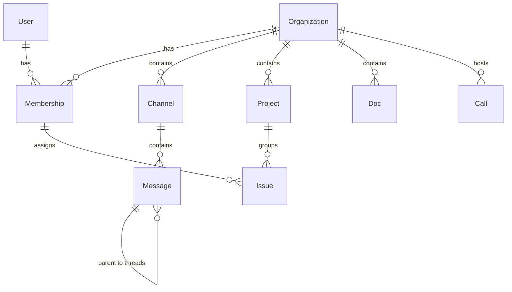

# OrangePlanetHQ — Domain Map

This document establishes the ubiquitous language and maps the domain models for OrangePlanetHQ. It matches standard product terminology (Linear, Slack, Notion) mapped to our backend database architecture.

## 1. Domain Terminology Mapping

| Product Context | Ubiquitous Term | Campsite Equivalent | Purpose |
|---|---|---|---|
| **Core Workspace** | `Organization` | `Organization` | The top-level tenant (workspace) identified by slug. |
| **Workspace Membership** | `Membership` | `OrganizationMembership` | Connects a `User` to an `Organization` with a role (owner, admin, member, viewer). |
| **Issue Tracker (Linear)** | `Issue` | *None* | A task or work item to be prioritized, assigned, and tracked. |
| **Issue Grouping** | `Project` | *None* | A milestone, epic, or group of related issues. |
| **Team Chat (Slack)** | `Channel` | `Project` (Campsite) | A text/voice communication room within an organization. |
| **Chat Message** | `Message` | `Message` | A single chat communication, DM, or threaded response. |
| **Documents (Notion)** | `Doc` | `Note` (Campsite) | A collaborative page or document. |
| **Meetings** | `Call` | `Call` | A real-time video/audio session. |

---

## 2. Bounded Context Relationships

---

## 3. Database Schema Models (Drizzle Target)

### Organizations & Memberships
- **`organizations`**: Holds the workspaces.
  - `id`: `uuidv7` (Primary Key, internal use only)
  - `name`: `varchar`
  - `slug`: `varchar` (Unique, used in URLs: `/org/acme`)
  - `key`: `varchar` (Unique, e.g. `PLO`, used to prefix issues)
  - `nextIssueNumber`: `integer` (Auto-incrementing counter for issue generation)
- **`memberships`**: Connects a `User` to an `Organization`.
  - `id`: `uuidv7` (Primary Key)
  - `userId`: `uuidv7` (Foreign Key)
  - `organizationId`: `uuidv7` (Foreign Key)
  - `role`: `varchar` (`owner`, `admin`, `member`, `viewer`)

### Issues & Projects (Linear Context)
- **`projects`**: Bounded groups for issues.
  - `id`: `uuidv7` (Primary Key)
  - `organizationId`: `uuidv7` (Foreign Key)
  - `name`: `varchar`
  - `slug`: `varchar` (Unique within org, e.g. `/project/mobile-app`)
- **`issues`**: The core work tracking item.
  - `id`: `uuidv7` (Primary Key)
  - `organizationId`: `uuidv7` (Foreign Key)
  - `projectId`: `uuidv7` (Foreign Key, nullable)
  - `number`: `integer` (Sequential index within organization, e.g., `24`)
  - `identifier`: `varchar` (Combined prefix, unique within org, e.g., `PLO-24`)
  - `slug`: `varchar` (Human-readable url slug, e.g. `fix-login-button`)
  - `title`: `text`
  - `description`: `text`
  - `status`: `varchar` (`backlog`, `todo`, `in_progress`, `done`, `canceled`)
  - `assigneeId`: `uuidv7` (Foreign Key to membership, nullable)

### Channels & Messages (Slack Context)
- **`channels`**: Communication spaces.
  - `id`: `uuidv7` (Primary Key)
  - `organizationId`: `uuidv7` (Foreign Key)
  - `name`: `varchar`
  - `slug`: `varchar` (Unique within org, e.g., `frontend-dev`)
  - `isPrivate`: `boolean`
- **`messages`**: Real-time message logs.
  - `id`: `uuidv7` (Primary Key)
  - `channelId`: `uuidv7` (Foreign Key)
  - `senderId`: `uuidv7` (Foreign Key to membership)
  - `content`: `text`
  - `parentId`: `uuidv7` (For thread replies)

### Documents (Notion Context)
- **`docs`**: Collaborative documents.
  - `id`: `uuidv7` (Primary Key)
  - `organizationId`: `uuidv7` (Foreign Key)
  - `title`: `varchar`
  - `slug`: `varchar` (URL slug, e.g. `technical-spec`)
  - `shortId`: `varchar` (8-char random suffix, e.g. `a8f9c2`)
  - `content`: `text`

---

## 4. Architectural Rules for Domains

1. **UUIDv7 Standard:** Every database table must use UUIDv7 as its primary key. Foreign keys must match the UUIDv7 type.
2. **Decoupled Identity:** Database primary keys (`id`) must remain strictly internal. Never expose database UUIDs in public URLs, UI components, or frontend routes.
3. **Public Identifiers:** Route lookups must resolve using unique human-readable values (`identifier`, `slug`, or `shortId`) rather than UUIDs.
4. **Issue Generation Sequence:** Generating a new issue requires a atomic transaction that:
   - Reads the organization's current `nextIssueNumber`.
   - Generates the string `identifier` (e.g. `{organization.key}-{nextIssueNumber}`).
   - Increments `nextIssueNumber` on the organization.
   - Commits the new issue record.
