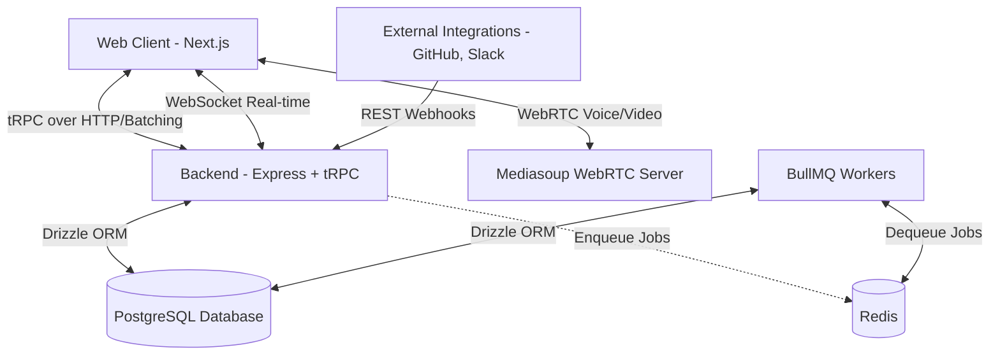

# OrangePlanetHQ — Architecture Overview

This document provides a high-level overview of the OrangePlanetHQ system architecture. It defines the core components, how they interact, and the data flow patterns.

## 1. System Context Diagram

## 2. Core Components

### Frontend (`apps/web`)
- **Framework:** Next.js (App Router)
- **State Management:** 
  - **Server State:** TanStack Query (via tRPC)
  - **Client/UI State:** Zustand (for transient UI state like sidebar open, modals)
- **UI:** TailwindCSS v4 + shadcn/Radix UI, centralized in `packages/ui`
- **Real-time:** Native WebSocket client for chat, `mediasoup-client` for calls.

### Backend (`apps/api`)
- **Runtime:** Node.js ≥ 22
- **Hybrid API Layer:**
  - **Internal:** tRPC (for type-safe communication with the frontend).
  - **External:** Express 5 (for REST endpoints like GitHub/Slack webhooks).
- **Real-time:** Native `ws` server (pub/sub pattern).
- **WebRTC:** Mediasoup SFU for voice/video/screen sharing.
- **Database Access:** Drizzle ORM to PostgreSQL.

### Background Workers
- **Queueing:** BullMQ + Redis.
- **Use cases:** Email sending, search indexing, webhook delivery, file processing.

## 3. Data Flow Patterns

### Request-Response (tRPC)
All standard CRUD operations between the frontend and backend happen via tRPC.
1. User clicks a button in Next.js.
2. `trpc.feature.action.useMutation()` is called.
3. tRPC procedure executes in Node.js, validates input (Zod), and queries Drizzle.
4. Strongly-typed result is returned.
5. TanStack Query automatically invalidates related queries.

### Real-time Events (WebSocket)
Chat messages, typing indicators, and presence do not rely on standard HTTP polling.
1. Client establishes a persistent WebSocket connection.
2. Server uses a pub/sub event bus to route events to specific channel rooms.
3. When a tRPC mutation occurs (e.g., "send message"), the server successfully writes to DB, then publishes an event to the bus.
4. Clients listening to that channel receive the event and update their local cache optimistically.

## 4. Multi-Tenancy Model
Following the Campsite reference architecture:
- Every resource is scoped to an `Organization`.
- Users belong to an Organization via an `OrganizationMembership` (which contains role data: admin, member, viewer, guest).
- Almost all tRPC procedures require checking the user's membership and permissions for the requested organization.
- IDs exposed to the frontend are public `cuid` or `uuid` strings, never internal auto-incrementing integers.

## 5. Monitoring & Analytics (Planned Integrations)

To align with modern production-grade SaaS architectures while remaining free-tier friendly for side projects:
- **Sentry:** Errors and exception tracking (configured on both Next.js frontend and Express backend).
- **PostHog:** Product analytics, session replays, custom event tracking, and feature flagging. Helps analyze user behavior and manage feature rollouts without building custom flag servers.
